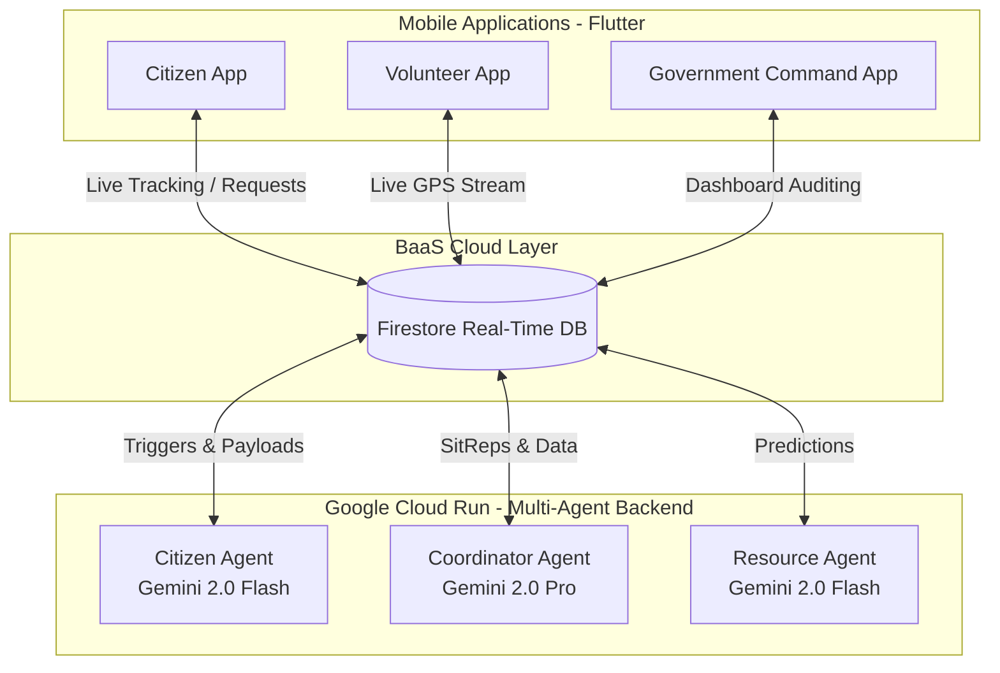

# 🌊 FloodSense — Autonomous Flood Disaster Response (GovTech Malaysia 2026)

> **Track 2: Citizens First (GovTech & Digital Services)**

### 🔗 Quick Links
| | Link |
|---|---|
| 📱 **Android APK** | [Download from Google Drive](https://drive.google.com/file/d/11uWIOHyn9rgJE4bH28FqogIkQssJj0jL/view?usp=sharing) *(Updated: April 2026)* |
| ☁️ **Live Backend API** | [https://floodsense-agents-653167130543.asia-southeast1.run.app](https://floodsense-agents-653167130543.asia-southeast1.run.app) |
| 📖 **Interactive API Docs** | [/docs](https://floodsense-agents-653167130543.asia-southeast1.run.app/docs) |
| 💻 **GitHub Repository** | [github.com/yapyap06/FloodSense](https://github.com/yapyap06/FloodSense) |

---

## 🎯 Problem Statement

Malaysia experiences devastating annual monsoon floods affecting millions of citizens. The current system suffers from:
- **Manual SOS processing** — rescue teams overwhelmed by unstructured distress messages
- **Bureaucratic aid claims** — JKM damage claim verification takes weeks
- **Zero real-time coordination** — volunteers and government agencies operate in silos
- **No proactive intelligence** — no system autonomously generates situational awareness for NADMA commanders

## 💡 Our Solution

FloodSense is an end-to-end autonomous agentic Government Technology solution that transitions disaster response from reactive "Chat" layers into fully **Autonomous Execution (Action)** via a Multi-Agent AI system built on the Google AI Ecosystem.

## 🏆 The Google AI Ecosystem Stack

This project was engineered exclusively on the Google AI Ecosystem Stack for the 2026 GovTech Challenge:

1. **The Intelligence (Brain): Gemini 2.0**
   - **Gemini 2.0 Flash:** Powers the **Citizen Agent** to handle real-time SOS triage and emergency data extraction (parsing GPS strings, routing requests, extracting headcounts).
   - **Gemini 2.0 Pro:** Powers the **Coordinator Agent** to generate comprehensive, multi-variable incident Situation Reports (SitReps) and perform complex supply-chain distribution modeling.

2. **The Orchestrator: Multi-Agent AI Workflows**
   - **Agentic Routing:** A system of specialized autonomous agents (Citizen Agent, Coordinator Agent, Resource Agent) that interact through Firebase Cloud Firestore as a message bus, ensuring high reliability in low-connectivity zones.
   - **Zero-Friction SOS:** Optimized for high-stress environments. The frontend focuses on instant data capture (GPS + Situation), while the backend Agent handles the complex triage autonomously.

3. **The Context: Grounded Execution**
   - **Retrieval-Augmented Generation (RAG):** The Chat AI and Command Assistant pull explicitly from vetted national civil defense (APM) and social welfare (JKM) SOP datasets (MKN Directive 20) to ground their safety instructions.

4. **The Development Lifecycle**
   - **Google Cloud Run:** Serverless, stateless deployment architecture for our FastAPI Multi-Agent routing engine.
   - **Firebase / GCP:** Firestore acts as the real-time operational database synchronizing actions between our 3 target applications (Citizen, Government, Volunteer).

## 🚀 Core Features List

FloodSense is fundamentally **not** a chatbot. It is a system of autonomous execution.

1. **Autonomous SOS Triage:** A citizen submits a frantic distress request. The **Citizen Agent** autonomously parses the telemetry and selection data via Gemini 2.0, extracting `{headcount: 2, vulnerable: true, address: "Kg Meru", urgency: "CRITICAL"}` and routes it to the correct agency (NADMA/APM).
2. **Crisis-Ready UI:** Real-time location pinning and status tracking that updates in milliseconds via Firestore, even on older 4G/LTE handsets.
3. **AI-Orchestrated Damage Claims:** Bypassing manual JKM verification. Citizens file claims for the RM 5,000 BWI scheme using an 100% evidence-based wizard. The **Agentic Audit** system identifies claim items and verifies them against government aid bands (Band A/B) instantly.
4. **Goverment Command AI:** The **Coordinator Agent** executes independent loops in the background—evaluating active SOS cases against volunteer locations and generating live Situation Reports for NADMA commanders.
5. **Multi-Lingual Safety Chat AI:** A conversational assistant that provides grounded, localized safety protocols in BM, English, and Manglish to ensure every citizen stays safe.

## 🏗 Architectural Overview

The FloodSense architecture uses Firebase Cloud Firestore as an ultra-low latency real-time message bus that synchronizes the Mobile Application interfaces directly with the Python Multi-Agent Backend framework.




## 💻 Tech Stack
* **Frontend:** Flutter (iOS / Android / Web Dashboard)
* **Backend:** Python (FastAPI, Smolagents, Google GenAI SDK)
* **Database & BaaS:** Firebase Cloud Firestore
* **AI Models:** Gemini 2.0 Flash, Gemini 2.0 Pro

## 🛠️ Google Developer Tools Used

| Tool | Role in FloodSense |
|---|---|
| **Gemini 2.0 Flash** | Powers Citizen Agent (SOS triage) and Resource Agent (supply modeling) |
| **Gemini 2.0 Pro** | Powers Coordinator Agent (SitRep generation and incident analytics) |
| **Firebase Cloud Firestore** | Real-time message bus syncing all 3 mobile apps with the AI backend |
| **Firebase Authentication** | Secure role-based access for Citizens, Volunteers, and Government officers |
| **Google Cloud Run** | Serverless container hosting for the FastAPI Multi-Agent backend |
| **Google Cloud Build** | CI/CD pipeline for automated Docker image builds and deployments |
| **Google AI SDK (Python)** | `google-generativeai` library powering all Gemini agent calls |
| **Antigravity (by Google DeepMind)** | AI pair programming assistant used throughout the development lifecycle |

## ☁️ Cloud Run Deployment (Live API)

The FloodSense Multi-Agent Backend is live on Google Cloud Run — **no login required**.

> 🟢 **Live Endpoint:** [`https://floodsense-agents-653167130543.asia-southeast1.run.app`](https://floodsense-agents-653167130543.asia-southeast1.run.app)
>
> 📖 **Interactive API Docs (Swagger UI):** [`/docs`](https://floodsense-agents-653167130543.asia-southeast1.run.app/docs)

| Endpoint | Method | Description |
|---|---|---|
| [`/health`](https://floodsense-agents-653167130543.asia-southeast1.run.app/health) | GET | Service health check & agent status |
| [`/alerts`](https://floodsense-agents-653167130543.asia-southeast1.run.app/alerts) | GET | Latest flood alerts from the system |
| [`/sitrep/latest`](https://floodsense-agents-653167130543.asia-southeast1.run.app/sitrep/latest) | GET | Most recent AI-generated Situation Report |
| [`/incidents`](https://floodsense-agents-653167130543.asia-southeast1.run.app/incidents) | GET | Active SOS incidents |
| [`/volunteers/available`](https://floodsense-agents-653167130543.asia-southeast1.run.app/volunteers/available) | GET | Available volunteer list |
| `/chat` | POST | Ask the AI flood safety assistant |

## 🛠 Setup & Installation

### 1. Prerequisites
* Flutter SDK (3.24+)
* Python 3.11+
* Firebase Account with an active project (Firestore Enabled)

### 2. Backend (FastAPI Agents)
```bash
cd agents
pip install -r requirements.txt
# Set your Gemini API keys
# Windows: setx GEMINI_API_KEY "your-key"
# Mac/Linux: export GEMINI_API_KEY="your-key"
python -m uvicorn agent_server:app --reload
```

### 3. Frontend (Flutter Mobile App)
```bash
cd mobile
flutter pub get
# Run on an Android or iOS emulator
flutter run
```

*Note: Firebase configuration is already initialized via `google-services.json` and `firebase_options.dart` in this repository.*

## 🎬 Testing the Prototype

### Method 1: Instant Download
You do not need to build the app from source to test it. We have provided a pre-compiled Android APK.
1. **[Download FloodSense.apk from Google Drive](https://drive.google.com/file/d/11uWIOHyn9rgJE4bH28FqogIkQssJj0jL/view?usp=sharing)** *(Latest build — April 2026)*
2. Please use an **Android phone device** to download and install this file directly. You can also drag and drop it into an Android Emulator.

### Method 2: Build from Source
If assessing the codebase locally, the live app contains a role-selection screen that does not strictly require login credentials:
1. Tap **"Warganegara (Citizen)"**: Test the **Zero-Friction SOS** flow and file an evidence-based damage claim.
2. Tap **"Pusat Arahan (Government)"** (Access Code: `9999`): See active SOS cases, audit damage claims, and interact with the **Command AI**.
3. Tap **"Sukarelawan (Volunteer)"**: Open the real-time Ops Map, accept missions, and witness the real-time GPS synchronization across the ecosystem.

## 🤖 AI Disclosure & Development Workflow

In compliance with hackathon requirements, we disclose that this project was developed using a hybrid human-AI pair programming workflow:

- **AI Coding Tools:** We utilized **Google Gemini** as a core coding partner for rapid prototyping, UI component generation in Flutter, and complex logic orchestration in Python.
- **AI-Generated Logic:** Portions of the Multi-Agent orchestration (Smolagents) and the RAG pipeline integration were co-developed with AI assistance to ensure adherence to Google Cloud and GenAI SDK best practices.
- **Core Strategy:** All architectural decisions, disaster response logic (MKN Directive 20 grounding), and system integration were designed and validated by the human team to ensure safety and accuracy in critical environments.
